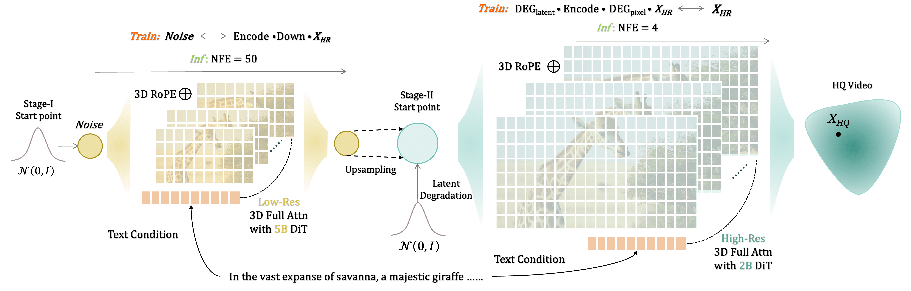

<p align="center">
     <br>

</p>

<div align="center">

# Flowing Fidelity to Detail for Efficient High-Resolution Video Generation

[](https://arxiv.org/abs/2502.05179)
[](https://jshilong.github.io/flashvideo-page/)&#160;

</div>

<div>

<p align="center">

<p>

> [**FlashVideo: Flowing Fidelity to Detail for Efficient High-Resolution Video Generation**](https://arxiv.org/abs/2502.05179)<br>
> [Shilong Zhang](https://jshilong.github.io/), [Wenbo Li](https://scholar.google.com/citations?user=foGn_TIAAAAJ&hl=en), [Shoufa Chen](https://www.shoufachen.com/), [Chongjian Ge](https://chongjiange.github.io/), [Peize Sun](https://peizesun.github.io/), <br>[Yida Zhang](<>),   [Yi Jiang](https://enjoyyi.github.io/), [Zehuan Yuan](https://shallowyuan.github.io/), [Bingyue Peng](<>), [Ping Luo](http://luoping.me/),
> <br>HKU, CUHK, ByteDance<br>

## 🤗 More video examples 👀 can be accessed at the [](https://jshilong.github.io/flashvideo-page/)

<!-- <p align="center">
     <br>

</p> -->

#### <span style="color:blue">⚡⚡</span> User Prompt to <span style="color:green">270p</span>, NFE = 50, Takes ~30s <span style="color:blue">⚡⚡
#### ⚡⚡</span>  <span style="color:green">270p</span> to <span style="color:purple">1080p</span> , NFE = 4, Takes ~72s <span style="color:blue">⚡⚡</span>

[](https://github.com/FoundationVision/flashvideo-page/blob/main/static/images/output.gif)


<!-- <p align="center">
     <br>

</p> -->


<p align="center">
 <br>

</p>

<!-- <video id="video1" width="960" height="270" controls poster="figs/22_0.jpg">
    <source src="https://github.com/FoundationVision/flashvideo-page/raw/refs/heads/main/static/githubfigs/270_1080/22_0.mp4" type="video/mp4">
    Your browser does not support the video tag.
</video> -->


## 🔥 Update

- \[2025.02.10\] 🔥 🔥 🔥  Inference code and both stage model [weights](https://huggingface.co/FoundationVision/FlashVideo/tree/main) have been released.

## 🌿 Introduction
In this repository, we provide:

- [x] The stage-I weight for 270P video generation.
- [x] The stage-II for enhancing 270P video to 1080P.
- [x] Inference code of both stages.
- [ ] Training code and related augmentation. Work in process [PR#12](https://github.com/FoundationVision/FlashVideo/pull/12)
    - [x] Loss function
    - [ ] Dataset and augmentation
    - [ ] Configuration and training script
- [ ] Implementation with diffusers.
- [ ] Gradio.


## Install

### 1. Environment Setup

This repository is tested with PyTorch 2.4.0+cu121 and Python 3.11.11. You can install the necessary dependencies using the following command:

```shell
pip install -r requirements.txt
```

### 2. Preparing the Checkpoints

To get the 3D VAE (identical to CogVideoX), along with Stage-I and Stage-II weights, set them up as follows:

```shell
cd FlashVideo
mkdir -p ./checkpoints
huggingface-cli download --local-dir ./checkpoints  FoundationVision/FlashVideo
```

The checkpoints should be organized as shown below:

```
├── 3d-vae.pt
├── stage1.pt
└── stage2.pt
```

## 🚀 Text to Video Generation

#### ⚠️ IMPORTANT NOTICE ⚠️  :  Both stage-I and stage-II are trained with long prompts only. For achieving the best results, include comprehensive and detailed descriptions in your prompts, akin to the example provided in [example.txt](./example.txt).

### Jupyter Notebook

You can conveniently provide user prompts in our Jupyter notebook. The default configuration for spatial and temporal slices in the VAE Decoder is tailored for an 80G GPU. For GPUs with less memory, one might consider increasing the [spatial and temporal slice](https://github.com/FoundationVision/FlashVideo/blob/400a9c1ef905eab3a1cb6b9f5a5a4c331378e4b5/sat/utils.py#L110).


```python
flashvideo/demo.ipynb
```

### Inferring from a Text File Containing Prompts

You can conveniently provide the user prompt in a text file and generate videos with multiple gpus.

```python
bash inf_270_1080p.sh
```

## License

This project is developed based on [CogVideoX](https://github.com/THUDM/CogVideo). Please refer to their original [license](https://github.com/THUDM/CogVideo?tab=readme-ov-file#model-license) for usage details.

## BibTeX

```bibtex
@article{zhang2025flashvideo,
  title={FlashVideo: Flowing Fidelity to Detail for Efficient High-Resolution Video Generation},
  author={Zhang, Shilong and Li, Wenbo and Chen, Shoufa and Ge, Chongjian and Sun, Peize and Zhang, Yida and Jiang, Yi and Yuan, Zehuan and Peng, Binyue and Luo, Ping},
  journal={arXiv preprint arXiv:2502.05179},
  year={2025}
}
```
