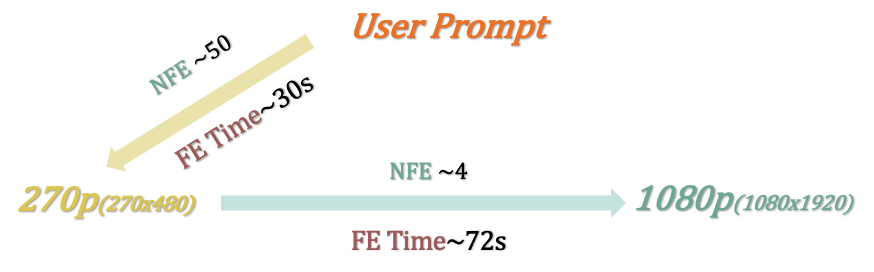

<p align="center">
     <br>

</p>

<div align="center">

# Flowing Fidelity to Detail for Efficient High-Resolution Video Generation

[](https://arxiv.org/abs/)
[](https://jshilong.github.io/flashvideo-page/)&#160;

</div>

<div>

<p align="center">

<p>

> [**FlashVideo:Flowing Fidelity to Detail for Efficient High-Resolution Video Generation**](https://arxiv.org/abs/)<br>
> [Shilong Zhang](https://jshilong.github.io/), [Wenbo Li](https://scholar.google.com/citations?user=foGn_TIAAAAJ&hl=en), [Shoufa Chen](https://www.shoufachen.com/), [Chongjian Ge](https://chongjiange.github.io/), [Peize Sun](https://peizesun.github.io/), <br>[Yida Zhang](<>),   [Yi Jiang](https://enjoyyi.github.io/), [Zehuan Yuan](https://shallowyuan.github.io/), [Bingyue Peng](<>), [Ping Luo](http://luoping.me/),
> <br>HKU, CUHK, ByteDance<br>

## 🤗 More video examples 👀 can be accessed at the [](https://jshilong.github.io/flashvideo-page/)

<!-- <p align="center">
     <br>

</p> -->

#### <span style="color:blue">⚡⚡</span> User Prompt to <span style="color:green">270p</span>, NFE = 50, Takes ~30s <span style="color:blue">⚡⚡
#### ⚡⚡</span>  <span style="color:green">270p</span> to <span style="color:purple">1080p</span> , NFE = 4, Takes ~72s <span style="color:blue">⚡⚡</span>
<!-- 
[](https://jshilong.github.io/flashvideo-page/static/githubfigs/270_1080/22_0.mp4) -->

<p>
    <video id="video1" width="960" height="270" controls poster="figs/22_0.jpg">
        <source src="https://jshilong.github.io/flashvideo-page/static/githubfigs/270_1080/22_0.mp4" type="video/mp4">
        Your browser does not support the video tag.
    </video>
</p>

## 🔥 Update

- \[2025.02.10\] 🔥 🔥 🔥  Inference code and both stage model [weights](https://huggingface.co/FoundationVision/FlashVideo/tree/main) have been released.

## 🌿 Introduction

In this repository, we provide:

- The stage-I weight for 270P video generation.
- The stage-II for enhancing 270P video to 1080P.
- Inference code of both stages.

## Install

### 1. Environment Setup

This repository is tested with PyTorch 2.4.0+cu121 and Python 3.11.11. You can install the necessary dependencies using the following command:

```shell
pip install -r requirements.txt
```

### 2. Preparing the Checkpoints

To get the 3D VAE (identical to CogVideoX), along with Stage-I and Stage-II weights, set them up as follows:

```shell
cd FlashVideo
mkdir -p ./checkpoints
huggingface-cli download --local-dir ./checkpoints  FoundationVision/FlashVideo
```

The checkpoints should be organized as shown below:

```
├── 3d-vae.pt
├── stage1.pt
└── stage2.pt
```

## 🚀 Text to Video Generation

#### ⚠️ IMPORTANT NOTICE ⚠️  :  Both stage-I and stage-II are trained with long prompts only. For achieving the best results, include comprehensive and detailed descriptions in your prompts, akin to the example provided in [example.txt](./example.txt).

### Jupyter Notebook

You can conveniently provide user prompts in our Jupyter notebook. The use of a single GPU with an 80G capacity is recommended. Alternatively, you may need to adjust the spatial and temporal slice of the VAE Decoder.

```python
sat/demo.ipynb
```

### Inferring from a Text File Containing Prompts

You can conveniently provide the user prompt in a text file and generate videos with multiple gpus.

```python
bash inf_270_1080p.sh
```

## License

This project is developed based on [CogVideoX](https://github.com/THUDM/CogVideo). Please refer to their original [license](https://github.com/THUDM/CogVideo?tab=readme-ov-file#model-license) for usage details.

## BibTeX

```bibtex
@article{shilong,
  title={},
  author={},
  journal={arXiv preprint arXiv:},
  year={2025}
}
```
